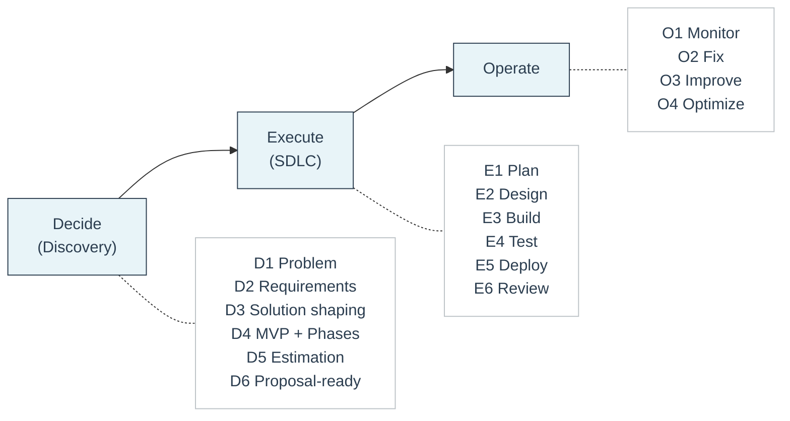

# D2E Framework
A one-page summary of our delivery framework.

D2E stands for **Decide, Execute, Operate**. It is the delivery framework Feel Coding uses to structure every client engagement.

The framework separates decisions from execution. Each phase is independent, documented, and produces concrete outputs that the client owns. A client can stop after any phase and still keep everything they need to continue on their own.

For the principles that guide how we operate, see [Core Principles](../company/core-principles.md).

> Discovery decides. SDLC executes. Ops stabilizes.

## 🧭 One-page overview

## ✅ How to read the framework

- **Decide (Discovery)** reduces risk and produces a clear plan.
- **Execute (SDLC)** builds the agreed solution in phases.
- **Operate** keeps the system healthy after delivery.

Each phase is detailed on its own page:

- [Decide (Discovery)](decide.md)
- [Execute (SDLC)](execute.md)
- [Operate](operate.md)

## 📌 When to use D2E

- The request is vague or risky.
- You need to estimate or propose.
- You want to avoid scope chaos.

## 🧱 Core rule

Do not start SDLC until Discovery is complete and approved.
