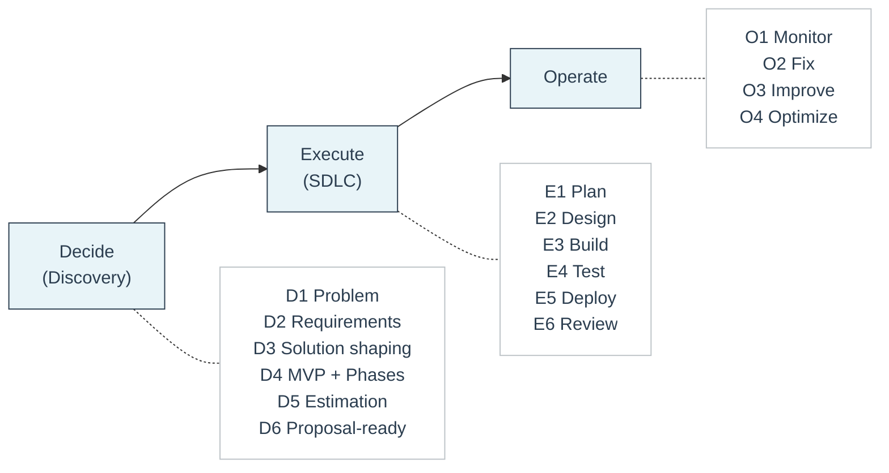

# D2E Framework 🧭

**A clear, phase-based delivery model**

The **D2E Framework (Decide → Execute → Operate)** is the delivery framework Feel Coding uses to structure **every client engagement**.

It exists to bring **clarity, predictability, and ownership** to software projects — especially when requirements are complex, evolving, or initially unclear.

For the principles that guide how we operate, see [Company Bible](../company/company-bible.md).

---

## What D2E Means

**D2E stands for:**

- **Decide** — clarify *what* to build and *why*
- **Execute** — build and ship the agreed solution
- **Operate** — keep the system stable, efficient, and transferable

The framework is built on a simple but strict rule:

> **Decisions come before execution.**

By separating decision-making from implementation, D2E prevents scope confusion, unclear expectations, and delivery risk.

---

## How the Framework Works

Each D2E phase is:

- **Independent** — it can stand on its own
- **Documented** — outputs are written and explicit
- **Owned by the client** — no vendor lock-in

A client can stop after **any phase** and still keep everything needed to continue with another team.

This protects clients while allowing engineers to work with clear constraints.

---

## The Three Phases at a Glance

### 🧠 Decide (Discovery)

Discovery is a **paid, standalone phase** focused on clarity and risk reduction.

Its goal is to answer:

- What problem are we solving?
- What does success look like?
- What should be built now — and what should wait?
- What are the risks, tradeoffs, and constraints?

**Discovery decides.**

---

### 🛠️ Execute (SDLC)

Execution turns approved decisions into working software.

It follows a structured SDLC loop:

- Plan
- Design
- Build
- Test
- Deploy
- Review

Execution does **not** redefine scope — it implements what Discovery already agreed on.

**SDLC executes.**

---

### ⚙️ Operate

Operate keeps the delivered system healthy after launch.

It focuses on:

- Monitoring and reliability
- Fixing issues and incidents
- Continuous improvement
- Cost and performance optimization

Operate is optional and can be hourly or retainer-based.

**Ops stabilizes.**

---

## One-Page Overview 📄

## How to Read the Framework ✅

- **Decide** reduces risk and produces a clear, shared plan
- **Execute** builds the agreed solution in controlled phases
- **Operate** keeps the system healthy after delivery

Across all phases:

- Each phase stands on its own
- Each phase produces documented outputs
- All outputs belong to the client

Each phase is explained in detail on its own page:

- [Decide (Discovery)](decide.md)
- [Execute (SDLC)](execute.md)
- [Operate](operate.md)

Each phase also has a matching template to ensure consistency:

- [Decide Template](../templates/decide-template.md)
- [Execute Template](../templates/execute-template.md)
- [Operate Template](../templates/operate-template.md)

---

## When to Use D2E 📌

Use the D2E framework when:

- The request is vague, complex, or risky
- You need to estimate or prepare a proposal
- You want to avoid scope creep and surprises
- You care about long-term maintainability and ownership

In practice: **almost always**.

---

## Core Rule 🧱

> **Do not start SDLC until Discovery is complete and approved.**

If D1–D6 do not exist and are not agreed on, you are still in Discovery.

This rule protects:

- Clients from unclear scope and cost overruns
- Engineers from changing goals mid-build
- Projects from avoidable failure
