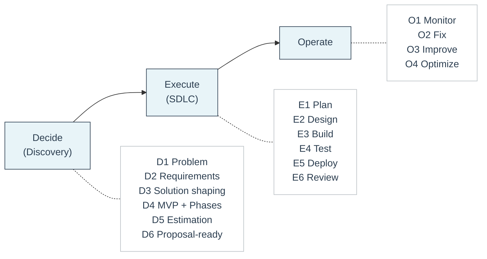

# D2E Framework

D2E stands for **Decide, Execute, Operate**. It is the delivery framework Feel Coding uses to structure every client engagement.

The framework separates decisions from execution. Each phase is independent, documented, and produces concrete outputs that the client owns. A client can stop after any phase and still keep everything they need to continue on their own.

> Discovery decides. SDLC executes. Ops stabilizes.

## Overview

Use this framework whenever:

- The client request is vague
- You need to estimate or propose
- You are dealing with complex integrations, distributed systems, or AI/RAG
- You want to avoid scope chaos

---

## 1) Decide (Discovery) — D1 through D6

Discovery is a **paid, standalone phase** focused on clarity and risk reduction. SDLC does not start until Discovery is complete and approved.

### D1 — Problem

**Goal:** Make the request concrete.

- Who is the buyer? Who is the user?
- What is the pain right now?
- What does success look like (measurable)?
- What are the constraints (time, budget, security)?

**Output:** 1-2 sentence problem statement + success metric.

### D2 — Requirements

**Goal:** Define what "done" means.

- Core user flows (happy path)
- Roles and permissions
- Integrations
- Edge cases
- Non-functional: security, performance, availability, compliance

**Output:** MVP flows + non-functional checklist.

### D3 — Solution shaping

**Goal:** Choose the direction and explain tradeoffs.

- Sketch architecture (boxes + arrows)
- Decide: REST vs GraphQL, monolith vs services, sync vs async
- If AI: RAG shape (sources, chunking, embedding, retrieval, answer + citations)
- List top 3 risks

**Output:** Architecture sketch + tradeoffs + risks.

### D4 — MVP and phases

**Goal:** Cut scope to reduce risk.

- What is the smallest usable version?
- What is explicitly out of scope?
- Phase 2/3 items (nice-to-have)

**Output:** MVP definition + phased roadmap.

### D5 — Estimation

**Goal:** Estimate with honesty and control risk.

- Range estimate (best / likely / worst)
- Identify unknowns needing a spike
- Add buffers for risk

**Output:** Estimate range + unknowns + spike plan.

### D6 — Proposal-ready

**Goal:** Convert everything into a plan you can ship to the client.

- Milestones
- Acceptance criteria
- Assumptions and exclusions
- Change control rule

**Output:** Proposal skeleton ready to send.

:::info Decision gate
If D1 through D6 exist and the client agrees, you start SDLC.
:::

---

## 2) Execute (SDLC) — E1 through E6

Execution is the SDLC loop that builds what Discovery already decided. Repeat E1-E6 until MVP is delivered.

### E1 — Plan

Tickets, milestones or sprints, acceptance criteria for the next slice.

### E2 — Design

API contracts, database changes, detailed design for the next slice.

### E3 — Build

Implement, integrate, infrastructure changes.

### E4 — Test

Unit and integration tests, key end-to-end tests, security sanity checks.

### E5 — Deploy

Staging to production, migrations, monitoring, rollback ready.

### E6 — Review

Demo to stakeholders, collect feedback, update backlog, decide next loop.

**Outputs per loop:** Working software increment, technical documentation, tests and deployment guidance.

---

## 3) Operate — O1 through O4

Operate keeps the system healthy after delivery. Can be hourly or retainer-based.

### O1 — Monitor

Logs, metrics, traces, uptime. If AI: retrieval and answer quality.

### O2 — Fix

Incidents, bugs, recovery, post-mortems.

### O3 — Improve

Performance, reliability, UX. If AI: RAG retrieval quality.

### O4 — Optimize

Cost, infrastructure, latency. If AI: model usage and token costs.

---

## Quick checklist

### When a lead arrives

1. **D1**: Can I state the problem + success metric?
2. **D2**: Do we know MVP flows + non-functional constraints?
3. **D3**: Do we have an architecture sketch + top risks?
4. **D4**: Is MVP clearly smaller than the full idea?
5. **D5**: Can I give a range + unknowns?
6. **D6**: Can I write milestones + acceptance + exclusions?

If "no" to any of these, you are still in Discovery.

### When building starts

Run the SDLC loop: E1 → E2 → E3 → E4 → E5 → E6 (repeat).

### After launch

Operate: O1 → O2 → O3 → O4.

---

## Key properties

- **Independent phases.** Each phase stands on its own. There is no lock-in.
- **Documented outputs.** Every phase produces documentation that belongs to the client.
- **Transferable.** The client can bring in a different team at any point.
- **Scalable.** Works for solo engagements and larger teams.
- **Rule:** Do not start SDLC until D1 through D6 exist and are agreed.
