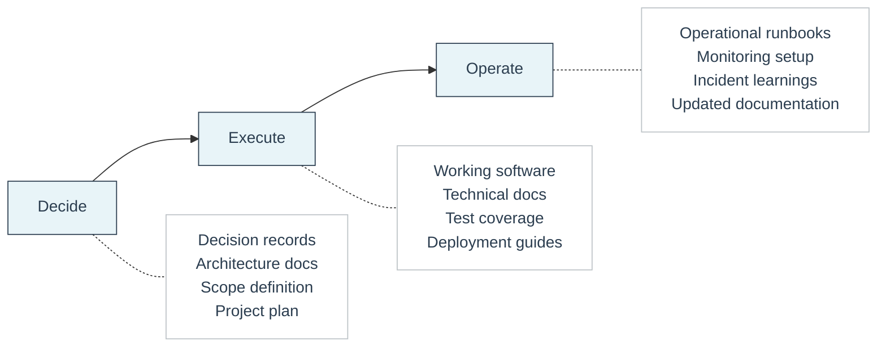

# D2E Framework

D2E stands for **Decide, Execute, Operate**. It is the delivery framework Feel Coding uses to structure every client engagement.

The framework divides work into three distinct phases. Each phase is independent, fully documented, and produces concrete outputs that the client owns. A client can stop after any phase and walk away with everything they need to continue on their own.

## Overview

## Phases

### Decide

Understanding the problem, evaluating options, and making clear decisions before any code is written.

| What we do | What we deliver |
|---|---|
| Problem definition and scoping | Decision records |
| Technical and architectural decisions | Architecture documentation |
| Risk identification | Scope definition |
| Prioritization of work | Project plan |

The client leaves this phase with a clear, documented plan they can execute with any team.

### Execute

Building what was decided. The focus is on shipping working software with clear documentation at every step.

| What we do | What we deliver |
|---|---|
| Development and implementation | Working software |
| Testing and quality assurance | Technical documentation |
| Documentation of what was built | Test coverage |
| Regular progress updates | Deployment guides |

The client leaves this phase with a fully built product and everything needed to operate it.

### Operate

Keeping the system healthy, responding to issues, and evolving the product over time.

| What we do | What we deliver |
|---|---|
| Monitoring and incident response | Operational runbooks |
| Performance optimization | Monitoring dashboards |
| Feature iteration | Incident history and learnings |
| Knowledge transfer | Updated documentation |

The client leaves this phase with a mature, well-understood system and the knowledge to maintain it independently.

## Key properties

- **Independent phases.** Each phase stands on its own. There is no lock-in.
- **Documented outputs.** Every phase produces documentation that belongs to the client.
- **Transferable.** The client can bring in a different team at any point. Documentation ensures continuity.
- **Scalable.** The framework works for small engagements and large ones.
