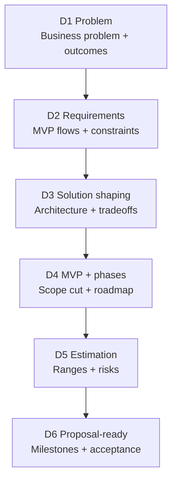

# Decide (Discovery) 🧭
**Clarity before building**

Discovery is a **paid, standalone phase** focused on clarity and risk reduction.

Its purpose is to make sure everyone clearly understands **what is being built, why it matters, and what it will take** — before time and budget are committed to execution.

Discovery produces the decisions that make delivery **safe, predictable, and transparent**.

---

## What This Phase Is For

Discovery exists to avoid common project problems such as:

- Building the wrong thing
- Unclear scope and expectations
- Budget or timeline surprises
- Late technical decisions
- Hidden assumptions

By the end of Discovery, there is a shared understanding between Feel Coding and the client about what will happen next.

---

## 🧠 What Discovery Decides

During Discovery, we clearly decide:

- **What problem we are solving** and why it matters
- **Who the product is for** and what success looks like
- **What the MVP is** (and what is not included)
- **What risks exist**, both technical and delivery-related
- **What it will take to build**, in terms of effort, phases, and timeline

All decisions are documented and reviewed with the client.

---

## The Discovery Steps (D1–D6)

Discovery follows six clear steps. Each step builds on the previous one.

---

## D1 — Problem and Outcomes

**Goal:** Make the request clear and measurable.

**We define:**
- The problem in plain language
- What success looks like
- Known constraints (time, budget, compliance, security)

---

## D2 — Requirements

**Goal:** Define what “done” means.

**We define:**
- Core user flows
- Roles and permissions
- Required integrations
- Non-functional needs (security, performance, scalability)

---

## D3 — Solution Shaping

**Goal:** Choose a technical direction and explain tradeoffs.

**We define:**
- A high-level solution approach
- Key technical decisions
- Main risks and unknowns

This ensures there are no hidden technical surprises later.

---

## D4 — MVP and Phases

**Goal:** Reduce scope and plan delivery safely.

**We define:**
- What the MVP includes
- What is explicitly out of scope
- What could come later (Phase 2 / Phase 3)

This step protects the project from overbuilding too early.

---

## D5 — Estimation

**Goal:** Provide an honest range, not a fixed promise.

**We define:**
- Best-case and worst-case estimates
- Known unknowns and required research (spikes)
- Risk buffers and assumptions

Estimates are transparent and realistic.

---

## D6 — Proposal-Ready Plan

**Goal:** Turn decisions into a clear plan the client can approve.

**We define:**
- Milestones and acceptance criteria
- Assumptions and exclusions
- How scope changes are handled

At this point, the client has a complete, actionable plan.

---

## What Discovery Produces

By the end of Discovery, the client receives:

- Clear problem definition and success criteria
- A well-defined MVP and phased roadmap
- Documented technical direction
- Transparent estimate range
- A proposal-ready execution plan

All outputs belong to the client.

---

## 🧱 Exit Criteria

Discovery is complete when:

- All decisions from D1 to D6 are documented and agreed
- The client can confidently move forward:
  - With Feel Coding, **or**
  - With another team, using the same materials

Only after this point does execution begin.

---

**Next:** [Execute (SDLC)](execute.md)
**Template:** [Decide Template](../templates/decide-template.md)
