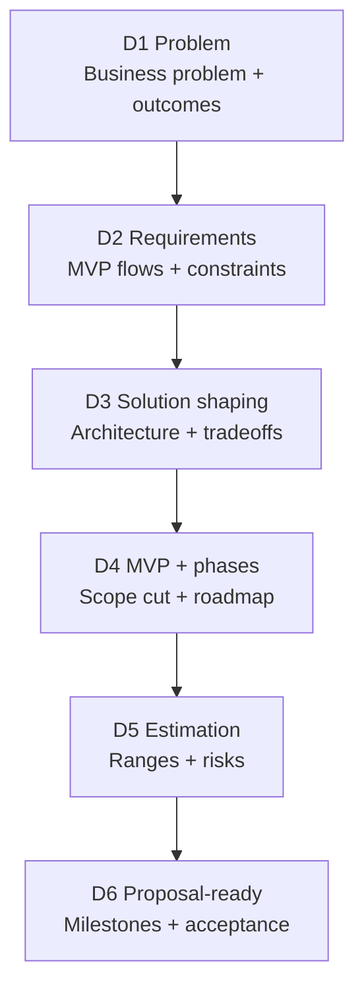

# Decide (Discovery)
What this phase is for and what it produces.

Discovery is a paid, standalone phase focused on clarity and risk reduction. It produces the decisions that make execution safe and predictable.

## 🧭 What Discovery decides

- What problem we are solving.
- Who the product is for.
- What the MVP is.
- What risks exist.
- What it will take to build.

## 📌 D1 to D6 overview

## D1 — Problem and outcomes

Goal: Make the request concrete and measurable.

Outputs:

- Problem statement in plain language.
- Success metrics.
- Constraints (time, budget, compliance).

## D2 — Requirements

Goal: Define what "done" means.

Outputs:

- Core user flows.
- Roles and permissions.
- Integrations.
- Non-functional requirements (security, performance, scale).

## D3 — Solution shaping

Goal: Choose a direction and explain tradeoffs.

Outputs:

- High-level architecture.
- Key technology decisions.
- Top technical risks.

## D4 — MVP and phases

Goal: Reduce scope and plan delivery.

Outputs:

- MVP definition.
- Explicit out-of-scope list.
- Phase 2/3 roadmap.

## D5 — Estimation

Goal: Provide a transparent range, not a false promise.

Outputs:

- Best and worst case range.
- Unknowns and needed spikes.
- Risk buffers.

## D6 — Proposal-ready plan

Goal: Convert decisions into a plan the client can approve.

Outputs:

- Milestones and acceptance criteria.
- Assumptions and exclusions.
- Change-control rule.

## 🧱 Exit criteria

Discovery is complete when:

- D1 through D6 exist and are agreed.
- The client can continue with or without Feel Coding.

Next: [Execute (SDLC)](execute.md)

Template: [Decide Template](../templates/decide-template.md)
