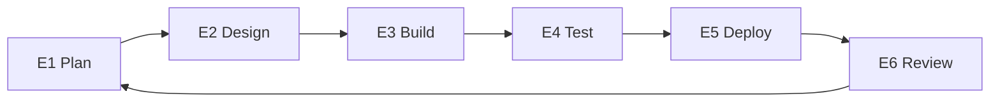

# Execute (SDLC)

Execution builds the agreed solution in repeatable phases. Each phase has a goal, a scope, and a clear checkpoint.

## 🔁 Execution loop (E1 to E6)

## ✅ How execution works

- Work is planned and approved phase by phase.
- Each phase has a clear goal and documented outputs.
- Review feedback informs the next phase.

## E1 — Plan

Goal: Define the next slice of work clearly.

Outputs:

- Milestones or sprint goal.
- Tickets and acceptance criteria.
- Updated risks or dependencies.

## E2 — Design

Goal: Make the solution buildable.

Outputs:

- API contracts.
- Data model changes.
- Infrastructure decisions.

## E3 — Build

Goal: Implement the agreed slice.

Outputs:

- Working code.
- Updated technical documentation.
- Infrastructure changes (if needed).

## E4 — Test

Goal: Validate behavior before release.

Outputs:

- Unit and integration tests.
- Targeted end-to-end checks.
- Security sanity checks.

## E5 — Deploy

Goal: Release safely.

Outputs:

- Production deployment.
- Monitoring and rollback readiness.

## E6 — Review

Goal: Close the loop and decide next steps.

Outputs:

- Demo and feedback.
- Backlog updates.
- Next phase decision.

## 🧱 Exit criteria

Execution ends when the MVP is delivered or the client stops.

Next: [Operate](operate.md)
