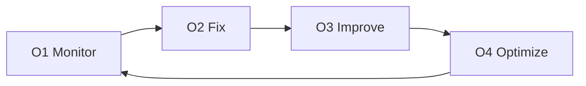

# Operate

Operate keeps the system healthy after delivery. It is focused on stability, reliability, and continuous improvement.

## 🔁 Operate loop (O1 to O4)

## O1 — Monitor

Goal: See issues before users do.

Outputs:

- Logs, metrics, traces.
- Uptime and alerting.
- Quality signals (if AI is involved).

## O2 — Fix

Goal: Resolve incidents and prevent repeats.

Outputs:

- Bug fixes.
- Incident reports or post-mortems.
- Recovery steps documented.

## O3 — Improve

Goal: Make the system better over time.

Outputs:

- Performance improvements.
- Reliability hardening.
- UX or workflow fixes.

## O4 — Optimize

Goal: Reduce cost and waste without harming quality.

Outputs:

- Infrastructure tuning.
- Cost optimization.
- AI usage tuning (if applicable).

## 🤝 Engagement options

Operate is typically hourly or retainer-based with a defined response window.

Next: [Pricing](../delivery/pricing.md)
