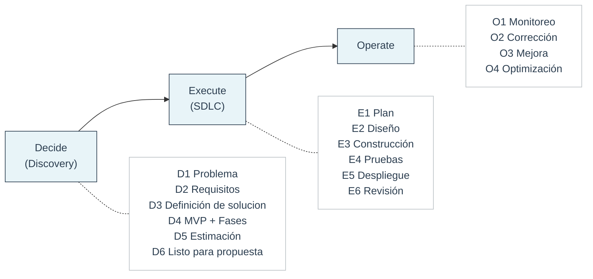

# Marco D2E 🧭

**Un modelo de entrega claro y por fases**

El **Marco D2E (Decide → Execute → Operate)** es el marco de entrega que Feel Coding usa para estructurar **cada proyecto con clientes**.

Existe para traer **claridad, previsibilidad y propiedad** a proyectos de software, especialmente cuando los requisitos son complejos, cambiantes o poco claros al inicio.

Para los principios que guían cómo operamos, ver [Biblia de la Empresa](../company/company-bible.md).

---

## Qué significa D2E

**D2E significa:**

- **Decide** — clarificar *qué* construir y *por qué*
- **Execute** — construir y entregar la solución acordada
- **Operate** — mantener el sistema estable, eficiente y transferible

El marco se basa en una regla simple pero estricta:

> **Las decisiones vienen antes que la ejecución.**

Separar decisiones de implementación evita confusión de alcance, expectativas poco claras y riesgo de entrega.

---

## Cómo funciona el marco

Cada fase D2E es:

- **Independiente** — puede sostenerse por sí sola
- **Documentada** — los outputs son escritos y explícitos
- **Propiedad del cliente** — sin lock-in de proveedor

Un cliente puede detenerse después de **cualquier fase** y conservar todo lo necesario para continuar con otro equipo.

Esto protege a los clientes y permite a los ingenieros trabajar con límites claros.

---

## Las tres fases en resumen

### 🧠 Decide (Discovery)

Discovery es una **fase paga y standalone** enfocada en claridad y reducción de riesgo.

Su objetivo es responder:

- ¿Qué problema resolvemos?
- ¿Qué es éxito?
- ¿Qué se construye ahora y qué se deja para después?
- ¿Cuáles son los riesgos, compensaciones y restricciones?

**Discovery decide.**

---

### 🛠️ Execute (SDLC)

Ejecución convierte decisiones aprobadas en software funcionando.

Sigue un ciclo SDLC estructurado:

- Plan
- Diseño
- Construcción
- Pruebas
- Despliegue
- Revisión

Ejecución **no redefine alcance** — implementa lo acordado en Discovery.

**SDLC ejecuta.**

---

### ⚙️ Operate

Operate mantiene el sistema saludable después del lanzamiento.

Se enfoca en:

- Monitoreo y confiabilidad
- Resolución de issues e incidentes
- Mejora continua
- Optimización de costos y rendimiento

Operate es opcional y puede ser por hora o abono mensual.

**Ops estabiliza.**

---

## Resumen en una página 📄

## Cómo leer el marco ✅

- **Decide** reduce riesgo y produce un plan claro y compartido
- **Execute** construye la solución acordada en fases controladas
- **Operate** mantiene el sistema saludable después de la entrega

A lo largo de todas las fases:

- Cada fase se sostiene por sí misma
- Cada fase produce outputs documentados
- Todos los outputs pertenecen al cliente

Cada fase está explicada en detalle en su propia página:

- [Decide (Discovery)](decide.md)
- [Execute (SDLC)](execute.md)
- [Operate](operate.md)

Cada fase también tiene una plantilla para asegurar consistencia:

- [Plantilla Decide](../templates/decide-template.md)
- [Plantilla Execute](../templates/execute-template.md)
- [Plantilla Operate](../templates/operate-template.md)

---

## Cuándo usar D2E 📌

Usa el marco D2E cuando:

- La solicitud es vaga, compleja o riesgosa
- Necesitas estimar o preparar una propuesta
- Quieres evitar alcance creep y sorpresas
- Te importa la mantenibilidad y el propiedad a largo plazo

En la práctica: **casi siempre**.

---

## Regla central 🧱

> **No iniciar SDLC hasta que Discovery esté completo y aprobado.**

Si D1–D6 no existen y no están acordados, sigues en Discovery.

Esta regla protege:

- A los clientes de un alcance poco claro y sobrecostos
- A los ingenieros de objetivos cambiantes en medio del construcción
- A los proyectos de fallas evitables
