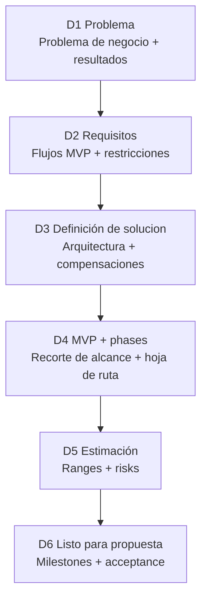

# Decide (Discovery) 🧭
**Claridad antes de construir**

Discovery es una **fase paga y standalone** enfocada en claridad y reducción de riesgo.

Su propósito es asegurar que todos entiendan claramente **qué se construye, por qué importa y qué se requiere** — antes de comprometer tiempo y presupuesto a la ejecución.

Discovery produce las decisiones que hacen la entrega **segura, predecible y transparente**.

---

## Para qué es esta fase

Discovery existe para evitar problemas comunes como:

- Construir lo incorrecto
- Alcance y expectativas poco claras
- Sorpresas de presupuesto o cronograma
- Decisiones técnicas tardías
- Supuestos ocultos

Al final de Discovery, hay un entendimiento compartido entre Feel Coding y el cliente sobre lo que viene.

---

## 🧠 Qué decide Discovery

Durante Discovery, decidimos con claridad:

- **Qué problema resolvemos** y por qué importa
- **Para quién es el producto** y cómo se ve el éxito
- **Cuál es el MVP** (y qué queda fuera)
- **Qué riesgos existen**, técnicos y de entrega
- **Qué se necesita para construir**, en esfuerzo, fases y cronograma

Todas las decisiones se documentan y se revisan con el cliente.

---

## Los pasos de Discovery (D1–D6)

Discovery sigue seis pasos claros. Cada paso construye sobre el anterior.

---

## D1 — Problemaa y resultados

**Objetivo:** Hacer el pedido claro y medible.

**Definimos:**
- El problema en lenguaje simple
- Cómo se ve el éxito
- Restricciones conocidas (tiempo, presupuesto, cumplimiento, seguridad)

---

## D2 — Requisitos

**Objetivo:** Definir qué significa “terminado”.

**Definimos:**
- Flujos principales
- Roles y permisos
- Integraciones requeridas
- Necesidades no funcionales (seguridad, rendimiento, escalabilidad)

---

## D3 — Solution Shaping

**Objetivo:** Elegir una dirección técnica y explicar compensaciones.

**Definimos:**
- Un enfoque de solución de alto nivel
- Decisiones técnicas clave
- Riesgos y desconocidos principales

Esto asegura que no haya sorpresas técnicas más adelante.

---

## D4 — MVP y fases

**Objetivo:** Reducir alcance y planear la entrega.

**Definimos:**
- Qué incluye el MVP
- Qué queda explícitamente fuera
- Qué podría venir después (Fase 2 / Fase 3)

Este paso protege al proyecto de construir de más demasiado pronto.

---

## D5 — Estimación

**Objetivo:** Dar un rango honesto, no una promesa fija.

**Definimos:**
- Estimaciónes de mejor y peor caso
- Desconocidos y investigaciones necesarios
- Buffers de riesgo y supuestos

Las estimaciones son transparentes y realistas.

---

## D6 — Plan listo para propuesta

**Objetivo:** Convertir decisiones en un plan claro que el cliente pueda aprobar.

**Definimos:**
- Hitos y criterios de aceptación
- Supuestos y exclusiones
- Cómo se manejan cambios de alcance

En este punto, el cliente tiene un plan completo y accionable.

---

## Qué produce Discovery

Al final de Discovery, el cliente recibe:

- Definición clara del problema y criterios de éxito
- MVP bien definido y hoja de ruta por fases
- Dirección técnica documentada
- Rango de estimación transparente
- Plan de ejecución listo para propuesta

Todos los outputs pertenecen al cliente.

---

## 🧱 Criterios de salida

Discovery está completo cuando:

- Todas las decisiones de D1 a D6 están documentadas y acordadas
- El cliente puede avanzar con confianza:
  - Con Feel Coding, **o**
  - Con otro equipo, usando los mismos materiales

Solo después de esto comienza la ejecución.

---

**Siguiente:** [Execute (SDLC)](execute.md)
**Plantilla:** [Plantilla Decide](../templates/decide-template.md)
