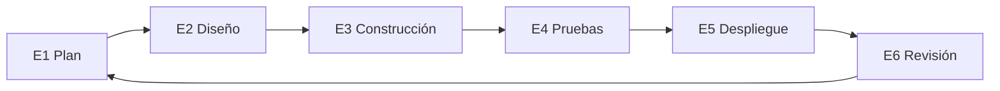

# Execute (SDLC) 🛠️
**Construyendo lo acordado**

Ejecución es la fase donde la solución definida en Discovery se **construye y entrega**.

Su propósito es convertir decisiones claras en **software funcionando**, de forma controlada y predecible.
Ejecución no redefine alcance — implementa lo ya acordado.

---

## Para qué es esta fase

Ejecución existe para:

- Construir la solución acordada paso a paso
- Reducir riesgo de entrega con incrementos pequeños y revisables
- Mantener el progreso visible y predecible
- Asegurar calidad antes de liberar

El trabajo se organiza en **fases repetibles**, cada una con un objetivo y checkpoint claro.

---

## Cómo funciona Ejecución ✅

Durante Ejecución:

- El trabajo se planifica **una fase a la vez**
- Cada fase tiene alcance y objetivo claros
- El progreso se revisa antes de avanzar
- El retroalimentación informa la siguiente fase

Este enfoque evita sorpresas y mantiene alineados al cliente y al equipo.

---

## Los pasos de Ejecución (E1–E6)

Ejecución sigue un ciclo simple y repetible.
Cada paso produce outputs concretos y documentados.

---

## E1 — Plan

**Objetivo:** Definir claramente el siguiente slice de trabajo.

**Definimos:**
- El objetivo de la siguiente fase o sprint
- Tareas o tickets con criterios de aceptación
- Riesgos o dependencias actualizados

Esto asegura que todos sepan qué se trabajará.

---

## E2 — Diseño

**Objetivo:** Dejar la solución lista para construir.

**Definimos:**
- Contratos o interfaces de API
- Cambios en modelo de datos o schema
- Decisiones de infraestructura o integraciones

Las decisiones de diseño se documentan antes de implementar.

---

## E3 — Construcción

**Objetivo:** Implementar el alcance acordado.

**Entregamos:**
- Código funcionando
- Documentación técnica actualizada
- Cambios de infraestructura (si aplica)

El construcción sigue el plan aprobado en pasos anteriores.

---

## E4 — Pruebas

**Objetivo:** Validar comportamiento antes de liberar.

**Realizamos:**
- Pruebass unitarios y de integración
- Checks end-to-end focalizados
- Checks básicos de seguridad y estabilidad

Este paso reduce el riesgo de issues en producción.

---

## E5 — Despliegue

**Objetivo:** Liberar de forma segura.

**Aseguramos:**
- Despliegue a producción
- Monitoreo en su lugar
- Opciones de rollback listas si es necesario

Los releases son deliberados y controlados.

---

## E6 — Revisión

**Objetivo:** Cerrar el ciclo y decidir lo siguiente.

**Entregamos:**
- Demo o revisión de lo construido
- Feedback recolectado
- Backlog y prioridades actualizados
- Decisión sobre la siguiente fase

Nada avanza sin revisión.

---

## Qué produce Ejecución

Al final de Ejecución, el cliente recibe:

- Incrementos de software funcionando
- Documentación clara de lo construido
- Cobertura de tests y guía de despliegue
- Registro transparente de decisiones y cambios

El progreso siempre es visible y entendible.

---

## 🧱 Criterios de salida

Ejecución termina cuando:

- El MVP acordado fue entregado, **o**
- El cliente decide detenerse

En cualquier momento, el cliente mantiene todo lo entregado y documentado.

---

**Siguiente:** [Operate](operate.md)
**Plantilla:** [Plantilla Execute](../templates/execute-template.md)
