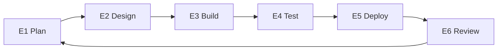

# Execute (SDLC) 🛠️
**Building what was agreed**

Execution is the phase where the solution defined in Discovery is **built and delivered**.

Its purpose is to turn clear decisions into **working software**, in a controlled and predictable way.
Execution does not redefine scope — it implements what was already agreed.

---

## What This Phase Is For

Execution exists to:

- Build the agreed solution step by step
- Reduce delivery risk through small, reviewable increments
- Keep progress visible and predictable
- Ensure quality before release

Work is organized into **repeatable phases**, each with a clear goal and checkpoint.

---

## How Execution Works ✅

During Execution:

- Work is planned **one phase at a time**
- Each phase has a clear scope and goal
- Progress is reviewed before moving forward
- Feedback informs the next phase

This approach avoids surprises and keeps both the client and the team aligned.

---

## The Execution Steps (E1–E6)

Execution follows a simple, repeatable loop.
Each step produces concrete, documented outputs.

---

## E1 — Plan

**Goal:** Define the next slice of work clearly.

**We define:**
- The goal of the next phase or sprint
- Tasks or tickets with acceptance criteria
- Updated risks or dependencies

This ensures everyone knows what is being worked on next.

---

## E2 — Design

**Goal:** Make the solution ready to build.

**We define:**
- API contracts or interfaces
- Data model or schema changes
- Infrastructure or integration decisions

Design decisions are documented before implementation begins.

---

## E3 — Build

**Goal:** Implement the agreed scope.

**We deliver:**
- Working code
- Updated technical documentation
- Infrastructure changes (if required)

Build work follows the approved plan from earlier steps.

---

## E4 — Test

**Goal:** Validate behavior before release.

**We perform:**
- Unit and integration tests
- Targeted end-to-end checks
- Basic security and stability checks

This step reduces the risk of issues reaching production.

---

## E5 — Deploy

**Goal:** Release safely.

**We ensure:**
- Production deployment is completed
- Monitoring is in place
- Rollback options are ready if needed

Releases are deliberate and controlled.

---

## E6 — Review

**Goal:** Close the loop and decide what comes next.

**We deliver:**
- A demo or review of what was built
- Collected feedback
- Updated backlog and priorities
- A decision on the next phase

Nothing moves forward without review.

---

## What Execution Produces

By the end of Execution, the client receives:

- Working software increments
- Clear documentation of what was built
- Test coverage and deployment guidance
- A transparent record of decisions and changes

Progress is always visible and understandable.

---

## 🧱 Exit Criteria

Execution ends when:

- The agreed MVP has been delivered, **or**
- The client chooses to stop

At any point, the client keeps all delivered work and documentation.

---

**Next:** [Operate](operate.md)
**Template:** [Execute Template](../templates/execute-template.md)
