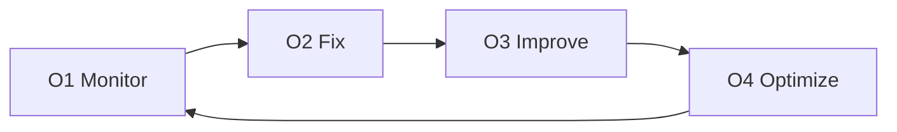

# Operate ⚙️
**Keeping systems healthy over time**

Operate is the phase focused on **running, maintaining, and improving** the system after delivery.

Its purpose is to keep the software **stable, reliable, and efficient** as it is used in the real world.
Operate ensures the system continues to perform well and remains easy to manage.

---

## What This Phase Is For

Operate exists to:

- Detect issues early
- Resolve problems quickly
- Improve performance and reliability over time
- Control operational and infrastructure costs

Operate is not about new features.
It is about keeping what was built **working well**.

---

## How Operate Works ✅

Operate follows a continuous cycle:

- Monitor the system in real usage
- Fix issues and incidents
- Improve reliability and performance
- Optimize costs and efficiency

This cycle repeats as long as the system is in use.

---

## The Operate Steps (O1–O4)

Each step has a clear purpose and produces documented outputs.

---

## O1 — Monitor

**Goal:** See issues before users do.

**We focus on:**
- Logs, metrics, and basic tracing
- Uptime and alerting
- Quality signals (including AI quality, if applicable)

Monitoring provides visibility into how the system behaves in production.

---

## O2 — Fix

**Goal:** Resolve incidents and prevent repeat issues.

**We deliver:**
- Bug and incident fixes
- Incident summaries or post-mortems (when needed)
- Documented recovery steps

Fixes are handled deliberately, not reactively.

---

## O3 — Improve

**Goal:** Make the system better over time.

**We deliver:**
- Performance improvements
- Reliability and stability enhancements
- UX or workflow improvements based on real usage

Improvements are guided by real data, not guesswork.

---

## O4 — Optimize

**Goal:** Reduce cost and waste without harming quality.

**We deliver:**
- Infrastructure tuning
- Cost and resource optimization
- AI usage and cost tuning (if applicable)

Optimization ensures the system remains sustainable as it scales.

---

## What Operate Produces

By engaging in Operate, clients receive:

- A stable and monitored system
- Faster incident response and recovery
- Continuous improvements based on real usage
- Better cost control over time
- Clear operational documentation

All operational knowledge is documented and shared with the client.

---

## 🤝 Engagement Options

Operate is optional and typically provided as:

- Hourly support, or
- A retainer with a defined response window

The engagement model is agreed in advance and can be adjusted as needs change.

---

**Next:** [Pricing](../delivery/pricing.md)
**Template:** [Operate Template](../templates/operate-template.md)
