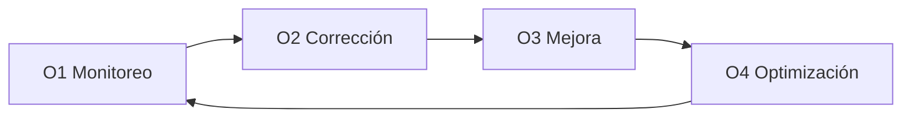

# Operate ⚙️
**Mantener sistemas saludables en el tiempo**

Operate es la fase enfocada en **operar, mantener y mejorar** el sistema después de la entrega.

Su propósito es mantener el software **estable, confiable y eficiente** en el uso real.
Operate asegura que el sistema siga funcionando bien y sea fácil de administrar.

---

## Para qué es esta fase

Operate existe para:

- Detectar issues temprano
- Resolver problemas rápidamente
- Mejorar rendimiento y confiabilidad con el tiempo
- Controlar costos operativos e infraestructura

Operate no es sobre nuevas features.
Es sobre mantener lo construido **funcionando bien**.

---

## Cómo funciona Operate ✅

Operate sigue un ciclo continuo:

- Monitoreoear el sistema en uso real
- Corregir issues e incidentes
- Mejorar confiabilidad y rendimiento
- Optimizar costos y eficiencia

Este ciclo se repite mientras el sistema esté en uso.

---

## Los pasos de Operate (O1–O4)

Cada paso tiene un propósito claro y produce outputs documentados.

---

## O1 — Monitoreo

**Objetivo:** Ver issues antes que los usuarios.

**Nos enfocamos en:**
- Logs, métricas y trazas básicas
- Uptime y alertas
- Señales de calidad (incluyendo calidad de AI si aplica)

El monitoreo da visibilidad de cómo se comporta el sistema en producción.

---

## O2 — Corrección

**Objetivo:** Resolver incidentes y evitar repeticiones.

**Entregamos:**
- Correcciónes de bugs e incidentes
- Resúmenes o post-mortems (cuando corresponde)
- Pasos de recuperación documentados

Los fixes se manejan de forma deliberada, no reactiva.

---

## O3 — Mejora

**Objetivo:** Hacer el sistema mejor con el tiempo.

**Entregamos:**
- Mejoras de rendimiento
- Mejoras de confiabilidad y estabilidad
- Mejoras de UX o flujo basadas en uso real

Las mejoras se guían por datos reales, no suposiciones.

---

## O4 — Optimización

**Objetivo:** Reducir costos y desperdicio sin afectar la calidad.

**Entregamos:**
- Tuning de infraestructura
- Optimización de costo y recursos
- Tuning de uso/costo de AI (si aplica)

La optimización mantiene el sistema sostenible al escalar.

---

## Qué produce Operate

Al trabajar en Operate, los clientes reciben:

- Un sistema estable y monitoreado
- Respuesta y recuperación más rápida ante incidentes
- Mejoras continuas basadas en uso real
- Mejor control de costos en el tiempo
- Documentación operativa clara

Todo el conocimiento operativo se documenta y se comparte con el cliente.

---

## 🤝 Opciones de proyecto

Operate es opcional y normalmente se ofrece como:

- Soporte por hora, o
- Retainer con ventana de respuesta definida

El modelo se acuerda por adelantado y puede ajustarse según cambien las necesidades.

---

**Siguiente:** [Precios](../entrega/precios.md)
**Plantilla:** [Plantilla Operate](../templates/operate-template.md)
