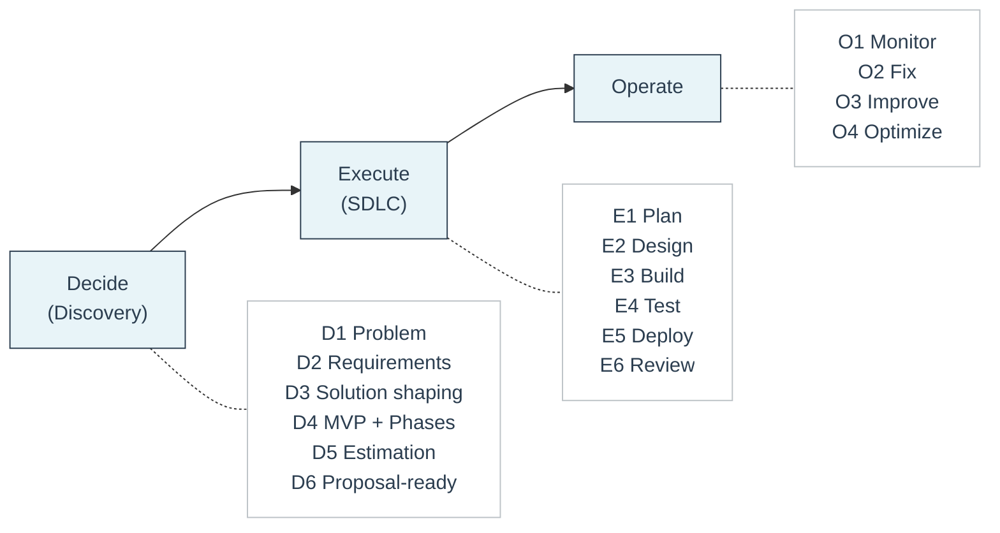

# D2E Framework 🧭

**Um modelo de entrega claro e por fases**

O **D2E Framework (Decide → Execute → Operate)** é o framework de delivery que a Feel Coding usa para estruturar **todo engagement com clientes**.

Ele existe para trazer **clareza, previsibilidade e ownership** a projetos de software — especialmente quando requisitos são complexos, evolutivos ou pouco claros no início.

Para os princípios que guiam como operamos, veja [Bíblia da Empresa](../company/company-bible.md).

---

## O que D2E significa

**D2E significa:**

- **Decide** — esclarecer *o que* construir e *por quê*
- **Execute** — construir e entregar a solução acordada
- **Operate** — manter o sistema estável, eficiente e transferível

O framework é baseado em uma regra simples e rígida:

> **Decisões vêm antes da execução.**

Separar decisões de implementação evita confusão de escopo, expectativas pouco claras e risco de entrega.

---

## Como o framework funciona

Cada fase D2E é:

- **Independente** — pode se sustentar sozinha
- **Documentada** — outputs são escritos e explícitos
- **De propriedade do cliente** — sem lock-in de fornecedor

Um cliente pode parar após **qualquer fase** e ainda manter tudo o que precisa para continuar com outro time.

Isso protege clientes e permite que engenheiros trabalhem com limites claros.

---

## As três fases em resumo

### 🧠 Decide (Discovery)

Discovery é uma **fase paga e standalone** focada em clareza e redução de risco.

Seu objetivo é responder:

- Qual problema estamos resolvendo?
- Como é o sucesso?
- O que deve ser feito agora e o que deve esperar?
- Quais são os riscos, tradeoffs e restrições?

**Discovery decide.**

---

### 🛠️ Execute (SDLC)

Execution transforma decisões aprovadas em software funcionando.

Segue um loop SDLC estruturado:

- Plan
- Design
- Build
- Test
- Deploy
- Review

Execution **não redefine escopo** — implementa o que foi acordado no Discovery.

**SDLC executa.**

---

### ⚙️ Operate

Operate mantém o sistema saudável após o lançamento.

Foca em:

- Monitoramento e confiabilidade
- Correção de issues e incidentes
- Melhoria contínua
- Otimização de custos e performance

Operate é opcional e pode ser por hora ou retainer.

**Ops estabiliza.**

---

## Resumo em uma página 📄

## Como ler o framework ✅

- **Decide** reduz risco e produz um plano claro e compartilhado
- **Execute** constrói a solução acordada em fases controladas
- **Operate** mantém o sistema saudável após a entrega

Ao longo de todas as fases:

- Cada fase se sustenta sozinha
- Cada fase produz outputs documentados
- Todos os outputs pertencem ao cliente

Cada fase é explicada em detalhes em sua própria página:

- [Decide (Discovery)](decide.md)
- [Execute (SDLC)](execute.md)
- [Operate](operate.md)

Cada fase também tem um template correspondente:

- [Decide Template](../templates/decide-template.md)
- [Execute Template](../templates/execute-template.md)
- [Operate Template](../templates/operate-template.md)

---

## Quando usar D2E 📌

Use o framework D2E quando:

- O pedido é vago, complexo ou arriscado
- Você precisa estimar ou preparar uma proposta
- Você quer evitar scope creep e surpresas
- Você se importa com manutenção e ownership de longo prazo

Na prática: **quase sempre**.

---

## Regra central 🧱

> **Não inicie o SDLC até que o Discovery esteja completo e aprovado.**

Se D1–D6 não existirem e não estiverem acordados, você ainda está em Discovery.

Esta regra protege:

- Clientes de escopo pouco claro e custos extras
- Engenheiros de metas que mudam no meio do build
- Projetos de falhas evitáveis
