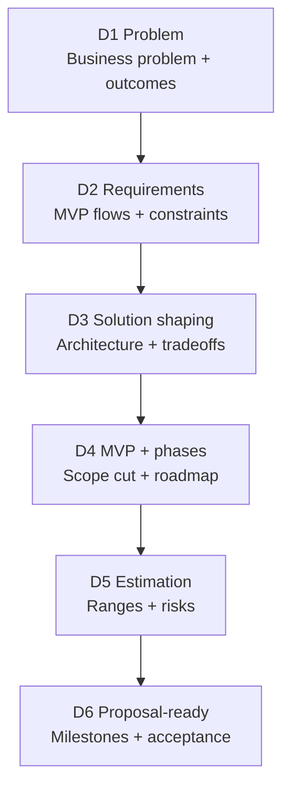

# Decide (Discovery) 🧭
**Clareza antes de construir**

Discovery é uma **fase paga e standalone** focada em clareza e redução de risco.

Seu propósito é garantir que todos entendam claramente **o que será construído, por que importa e o que será necessário** — antes de comprometer tempo e orçamento com a execução.

Discovery produz as decisões que tornam a entrega **segura, previsível e transparente**.

---

## Para que esta fase serve

Discovery existe para evitar problemas comuns como:

- Construir a coisa errada
- Escopo e expectativas pouco claros
- Surpresas de orçamento ou timeline
- Decisões técnicas tardias
- Premissas ocultas

Ao final do Discovery, há um entendimento compartilhado entre a Feel Coding e o cliente sobre o que acontece a seguir.

---

## 🧠 O que o Discovery decide

Durante o Discovery, decidimos com clareza:

- **Qual problema estamos resolvendo** e por que ele importa
- **Para quem é o produto** e como é o sucesso
- **Qual é o MVP** (e o que fica de fora)
- **Quais riscos existem**, técnicos e de delivery
- **O que será necessário para construir**, em esforço, fases e timeline

Todas as decisões são documentadas e revisadas com o cliente.

---

## Os passos do Discovery (D1–D6)

Discovery segue seis passos claros. Cada passo constrói sobre o anterior.

---

## D1 — Problema e resultados

**Objetivo:** Tornar o pedido claro e mensurável.

**Definimos:**
- O problema em linguagem simples
- Como é o sucesso
- Restrições conhecidas (tempo, orçamento, compliance, segurança)

---

## D2 — Requisitos

**Objetivo:** Definir o que significa “pronto”.

**Definimos:**
- Fluxos principais
- Papéis e permissões
- Integrações necessárias
- Necessidades não funcionais (segurança, performance, escalabilidade)

---

## D3 — Solution Shaping

**Objetivo:** Escolher uma direção técnica e explicar tradeoffs.

**Definimos:**
- Uma abordagem de solução em alto nível
- Decisões técnicas-chave
- Principais riscos e unknowns

Isso garante que não existam surpresas técnicas depois.

---

## D4 — MVP e fases

**Objetivo:** Reduzir escopo e planejar a entrega.

**Definimos:**
- O que o MVP inclui
- O que está explicitamente fora do escopo
- O que pode vir depois (Fase 2 / Fase 3)

Este passo protege o projeto de overbuilding cedo demais.

---

## D5 — Estimativa

**Objetivo:** Dar uma faixa honesta, não uma promessa fixa.

**Definimos:**
- Estimativas de melhor e pior caso
- Unknowns e spikes necessários
- Buffers de risco e premissas

As estimativas são transparentes e realistas.

---

## D6 — Plano pronto para proposta

**Objetivo:** Transformar decisões em um plano claro que o cliente possa aprovar.

**Definimos:**
- Marcos e critérios de aceitação
- Premissas e exclusões
- Como mudanças de escopo são tratadas

Neste ponto, o cliente tem um plano completo e acionável.

---

## O que o Discovery produz

Ao final do Discovery, o cliente recebe:

- Definição clara do problema e critérios de sucesso
- MVP bem definido e roadmap por fases
- Direção técnica documentada
- Faixa de estimativa transparente
- Plano de execução pronto para proposta

Todos os outputs pertencem ao cliente.

---

## 🧱 Critérios de saída

Discovery está completo quando:

- Todas as decisões de D1 a D6 estão documentadas e acordadas
- O cliente pode avançar com confiança:
  - Com a Feel Coding, **ou**
  - Com outro time, usando os mesmos materiais

Somente depois disso a execução começa.

---

**Próximo:** [Execute (SDLC)](execute.md)
**Template:** [Decide Template](../templates/decide-template.md)
