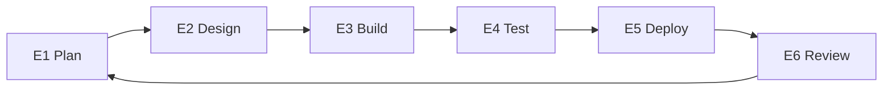

# Execute (SDLC) 🛠️
**Construindo o que foi acordado**

Execução é a fase em que a solução definida no Discovery é **construída e entregue**.

Seu propósito é transformar decisões claras em **software funcionando**, de forma controlada e previsível.
Execução não redefine escopo — implementa o que já foi acordado.

---

## Para que esta fase serve

Execução existe para:

- Construir a solução acordada passo a passo
- Reduzir risco de delivery com incrementos pequenos e revisáveis
- Manter o progresso visível e previsível
- Garantir qualidade antes do release

O trabalho é organizado em **fases repetíveis**, cada uma com objetivo e checkpoint claros.

---

## Como a Execução funciona ✅

Durante a Execução:

- O trabalho é planejado **uma fase por vez**
- Cada fase tem escopo e objetivo claros
- O progresso é revisado antes de avançar
- O feedback orienta a próxima fase

Essa abordagem evita surpresas e mantém cliente e time alinhados.

---

## Os passos da Execução (E1–E6)

Execução segue um loop simples e repetível.
Cada passo produz outputs concretos e documentados.

---

## E1 — Plan

**Objetivo:** Definir claramente o próximo slice de trabalho.

**Definimos:**
- O objetivo da próxima fase ou sprint
- Tarefas ou tickets com critérios de aceitação
- Riscos ou dependências atualizados

Isso garante que todos saibam o que será trabalhado.

---

## E2 — Design

**Objetivo:** Deixar a solução pronta para construir.

**Definimos:**
- Contratos ou interfaces de API
- Mudanças no modelo de dados ou schema
- Decisões de infraestrutura ou integrações

Decisões de design são documentadas antes da implementação.

---

## E3 — Build

**Objetivo:** Implementar o escopo acordado.

**Entregamos:**
- Código funcionando
- Documentação técnica atualizada
- Mudanças de infraestrutura (se necessário)

O build segue o plano aprovado nos passos anteriores.

---

## E4 — Test

**Objetivo:** Validar comportamento antes do release.

**Realizamos:**
- Tests unitários e de integração
- Checks end-to-end direcionados
- Checks básicos de segurança e estabilidade

Este passo reduz o risco de issues em produção.

---

## E5 — Deploy

**Objetivo:** Liberar com segurança.

**Garantimos:**
- Deploy em produção concluído
- Monitoramento em funcionamento
- Opções de rollback prontas se necessário

Releases são deliberados e controlados.

---

## E6 — Review

**Objetivo:** Fechar o loop e decidir o que vem depois.

**Entregamos:**
- Demo ou review do que foi construído
- Feedback coletado
- Backlog e prioridades atualizados
- Decisão sobre a próxima fase

Nada avança sem review.

---

## O que a Execução produz

Ao final da Execução, o cliente recebe:

- Incrementos de software funcionando
- Documentação clara do que foi construído
- Cobertura de testes e guia de deploy
- Registro transparente de decisões e mudanças

O progresso é sempre visível e compreensível.

---

## 🧱 Critérios de saída

A Execução termina quando:

- O MVP acordado foi entregue, **ou**
- O cliente decide parar

Em qualquer momento, o cliente mantém todo o trabalho e documentação entregues.

---

**Próximo:** [Operate](operate.md)
**Template:** [Execute Template](../templates/execute-template.md)
