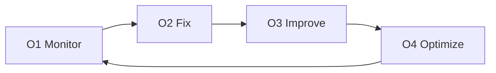

# Operate ⚙️
**Mantendo sistemas saudáveis ao longo do tempo**

Operate é a fase focada em **operar, manter e melhorar** o sistema após a entrega.

Seu propósito é manter o software **estável, confiável e eficiente** no uso real.
Operate garante que o sistema continue performando bem e seja fácil de gerir.

---

## Para que esta fase serve

Operate existe para:

- Detectar issues cedo
- Resolver problemas rapidamente
- Melhorar performance e confiabilidade ao longo do tempo
- Controlar custos operacionais e de infraestrutura

Operate não é sobre novas features.
É sobre manter o que foi construído **funcionando bem**.

---

## Como a Operate funciona ✅

Operate segue um ciclo contínuo:

- Monitorar o sistema em uso real
- Corrigir issues e incidentes
- Melhorar confiabilidade e performance
- Otimizar custos e eficiência

Este ciclo se repete enquanto o sistema estiver em uso.

---

## Os passos da Operate (O1–O4)

Cada passo tem um propósito claro e produz outputs documentados.

---

## O1 — Monitor

**Objetivo:** Ver issues antes dos usuários.

**Focamos em:**
- Logs, métricas e tracing básico
- Uptime e alertas
- Sinais de qualidade (incluindo qualidade de AI, se aplicável)

O monitoramento dá visibilidade de como o sistema se comporta em produção.

---

## O2 — Fix

**Objetivo:** Resolver incidentes e evitar repetição.

**Entregamos:**
- Correções de bugs e incidentes
- Resumos de incidentes ou post-mortems (quando necessário)
- Passos de recuperação documentados

As correções são tratadas de forma deliberada, não reativa.

---

## O3 — Improve

**Objetivo:** Tornar o sistema melhor ao longo do tempo.

**Entregamos:**
- Melhorias de performance
- Melhorias de confiabilidade e estabilidade
- Melhorias de UX ou fluxo com base no uso real

As melhorias são guiadas por dados reais, não por achismos.

---

## O4 — Optimize

**Objetivo:** Reduzir custos e desperdício sem prejudicar a qualidade.

**Entregamos:**
- Ajustes de infraestrutura
- Otimização de custo e recursos
- Ajuste de uso/custo de AI (se aplicável)

A otimização mantém o sistema sustentável conforme escala.

---

## O que a Operate produz

Ao atuar em Operate, os clientes recebem:

- Um sistema estável e monitorado
- Resposta e recuperação mais rápidas a incidentes
- Melhorias contínuas baseadas em uso real
- Melhor controle de custos ao longo do tempo
- Documentação operacional clara

Todo o conhecimento operacional é documentado e compartilhado com o cliente.

---

## 🤝 Opções de engagement

Operate é opcional e normalmente oferecido como:

- Suporte por hora, ou
- Retainer com janela de resposta definida

O modelo é acordado previamente e pode ser ajustado conforme a necessidade.

---

**Próximo:** [Preços](../delivery/pricing.md)
**Template:** [Operate Template](../templates/operate-template.md)
